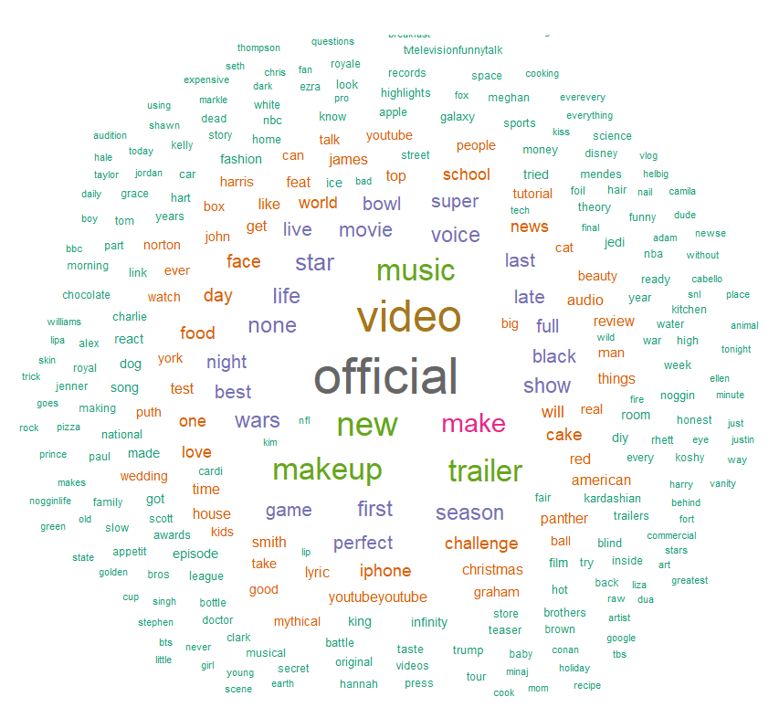
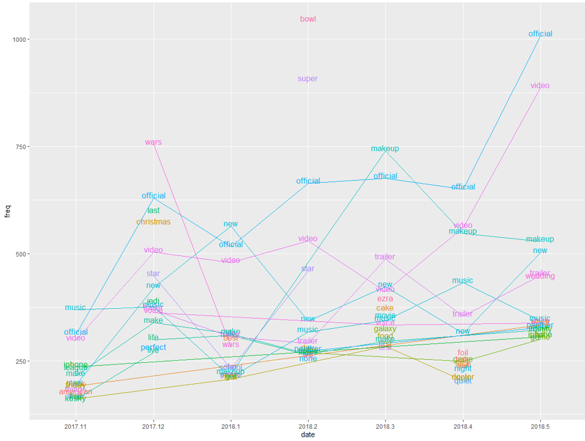
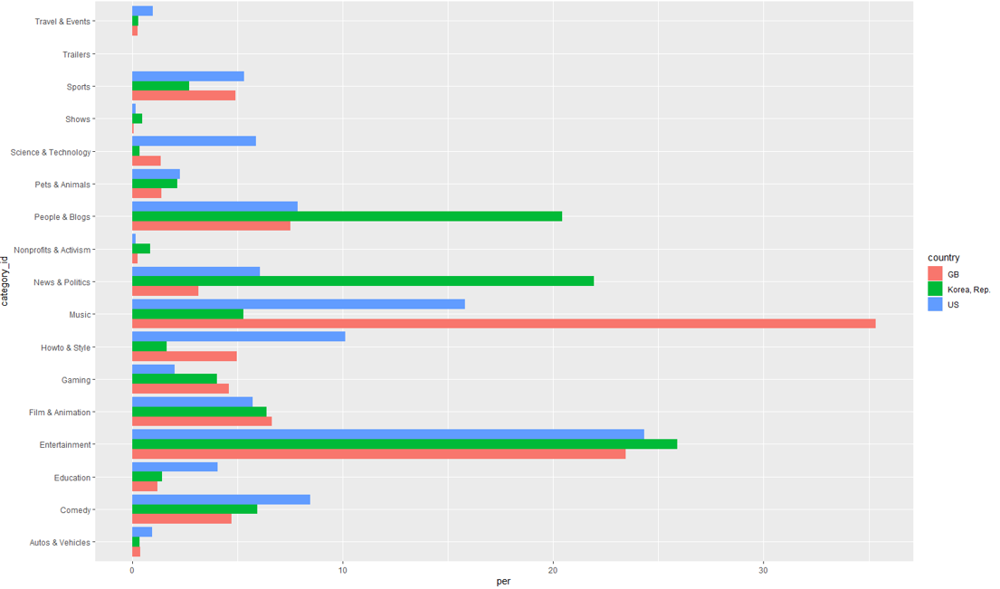
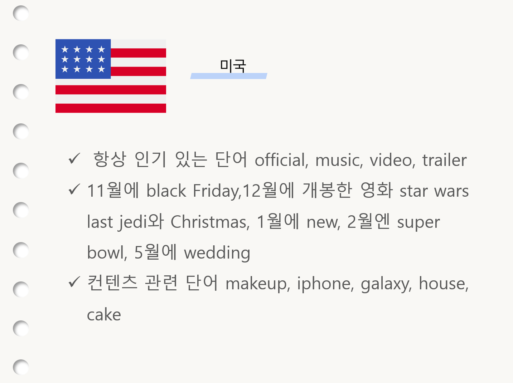
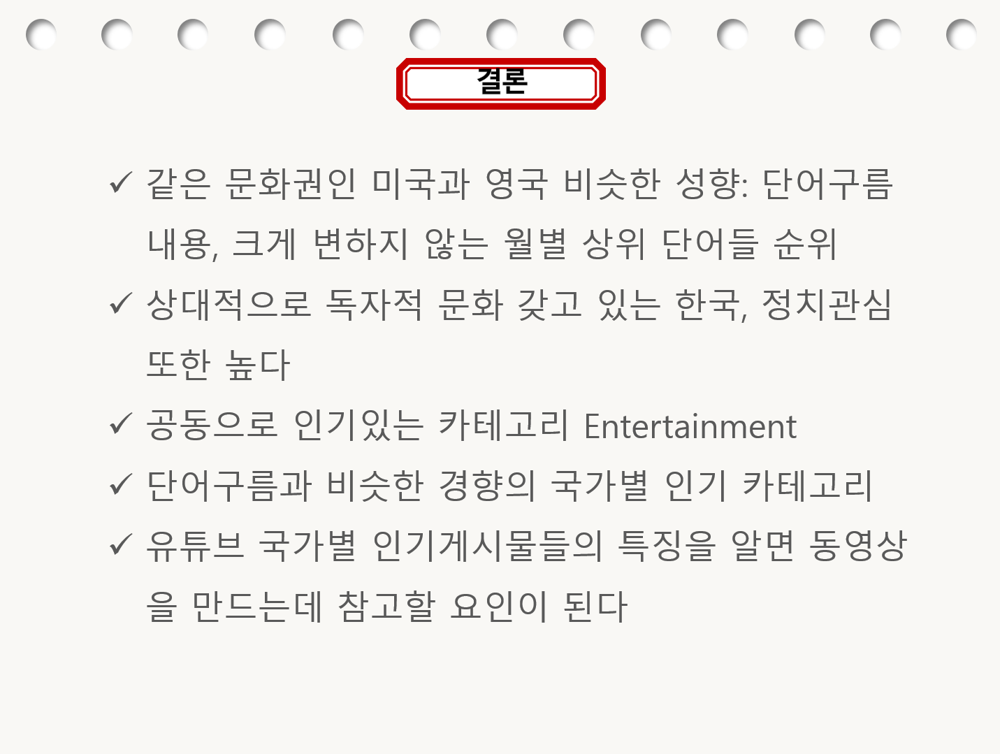

# Rstudy  
## YouTube_Project

### 목표
 Kaggle의 ‘Trending YouTube Video Statistics’ 데이터에서
2017년 11월부터 2018년 5월동안의 한국,미국,영국 세 나라의 
   유튜브 인기 동영상들의 제목,태그,카테고리 정보를 얻어
   국가별 단어구름과 월별 Top10 추이 그래프를 만들고 인기동영상의 요인이 무엇일지 분석해본다.

### 결과물 예시

### 개발환경과 필수 라이브러리
Rstudio에서 작성하였으며 다음과 같은 라이브러리가 필수로 필요하다  
library(dplyr)  
library(ggplot2)
library(tidyr)#unite()위해  
  
  
Sys.setenv(JAVA_HOME="C:/Program Files/Java/jre-10.0.2/")#개인 환경에 맡는 자바 위치  
  
library(rJava)  
library(KoNLP)  
library(tm)          #corpus,텍스트문서들 집합  
library(SnowballC)   #어근 추출  
library(RColorBrewer)#단어구름 만들기  
library(wordcloud)   #color palettes  
  
useSejongDic()#사전 준비  
options(mc.cores=1)#멀티코어 사용x,선택적  
+extractNount()은 한국어, tm패키지의 사용은 영어 단어 추출에 더 정확하다  
